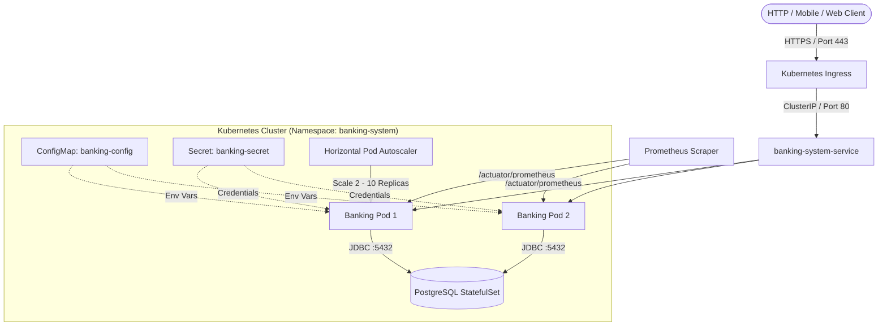

# Banking System - Production Architecture & Operations Guide

This guide details the architecture, security practices, CI/CD pipeline, Kubernetes deployment, and observability stack for the Banking System application.

---

## 🏗️ Architecture Overview



---

## 🔒 Security Practices

1. **Non-Root Container Execution:**
   - Docker container runs under UID `10001` (`appuser`) with dropped Linux capabilities.
   - `allowPrivilegeEscalation: false` enforced in Kubernetes pod securityContext.
2. **Secrets Management:**
   - Database credentials are externalized via `k8s/secret.yaml`.
   - In production, mount secrets via **External Secrets Operator (ESO)** connected to AWS Secrets Manager, Azure Key Vault, or HashiCorp Vault.
3. **Automated Security Gates:**
   - **Secret Scanning:** Gitleaks scans git history on every push/PR.
   - **Dependency Scanning (SCA):** Trivy filesystem scanner scans `pom.xml` for known CVEs.
   - **Docker Image Scanning:** Trivy container scanner inspects base image and binaries for critical/high vulnerabilities before publishing.

---

## 🚀 CI/CD Pipeline Workflow

The automated GitHub Actions workflow (`.github/workflows/ci-cd.yml`) executes:

1. **Stage 1: Test & Code Coverage**
   - Runs unit and integration test suite (`mvn clean verify`).
   - Generates JaCoCo test coverage report (`target/site/jacoco/index.html`).
2. **Stage 2: Security & Vulnerability Scanning**
   - Gitleaks secret leak detection.
   - Trivy static dependency vulnerability scan with SARIF report upload to GitHub Security tab.
3. **Stage 3: Artifact Packaging & Versioning**
   - Dynamic version tagging: `v1.0.<run_number>-<short_sha>`.
   - Produces and archives the production JAR artifact.
4. **Stage 4: Container Build & Image Scan**
   - Builds multi-stage Docker image with layer caching.
   - Scans container image with Trivy.
   - Pushes verified image to GitHub Container Registry (`ghcr.io`).
5. **Stage 5: Kubernetes Manifest Validation**
   - Validates Kustomize resources and runs dry-run manifest linting.

---

## ☸️ Kubernetes Deployment Instructions

### 1. Deploy All Components using Kustomize
```bash
kubectl apply -k k8s/
```

### 2. Verify Deployment Status
```bash
# Check running pods
kubectl get pods -n banking-system

# Check services & endpoints
kubectl get svc -n banking-system

# Check auto-scaling status
kubectl get hpa -n banking-system
```

### 3. Check Health & Readiness Probes
```bash
kubectl exec -it -n banking-system deployment/banking-system-deployment -- curl http://localhost:8080/actuator/health
```

---

## 📊 Observability & Monitoring

| Endpoint | Purpose | Target |
| :--- | :--- | :--- |
| `/actuator/health/liveness` | Pod restart check | Kubernetes Liveness Probe |
| `/actuator/health/readiness` | Pod traffic readiness check | Kubernetes Readiness Probe |
| `/actuator/prometheus` | Prometheus metric scraping | Prometheus Server / Grafana |
| `/actuator/metrics` | Spring JVM and HTTP metrics | Operations debugging |

### Structured Logging
Logs are formatted with timestamp, thread ID, log level, and logger name via `src/main/resources/logback-spring.xml` for seamless ingestion into ELK, Loki, or Datadog.
